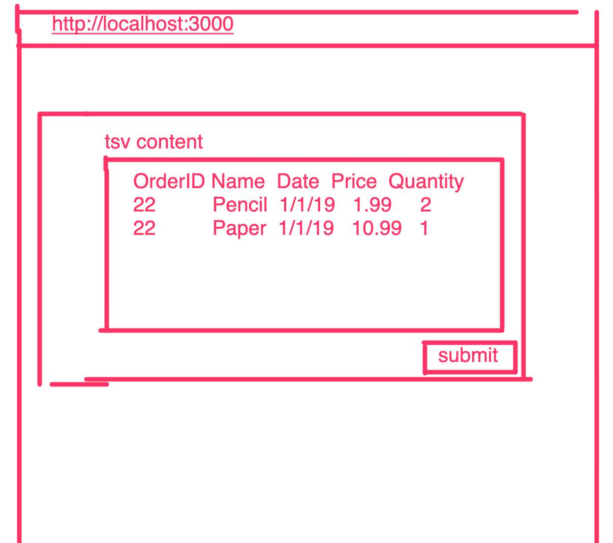
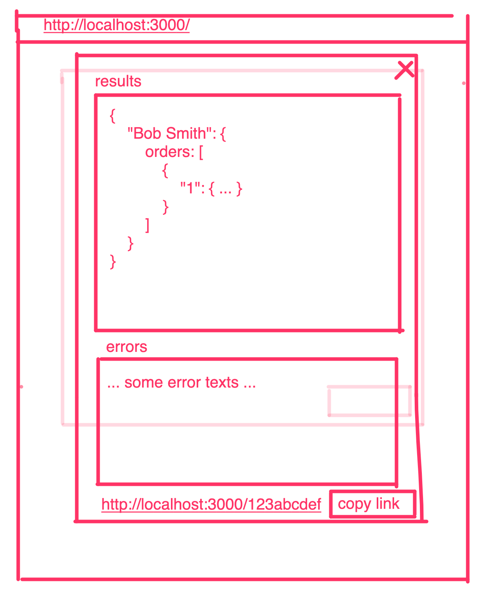

# Technical Exercise (Please Treat As Confidential)

## Build a web application that transforms tab-delimited data into a JSON output.

### Included files

* `INSTRUCTIONS.md` - This file.
* `tsv2json.js` - Some custom business logic, written in javascript, to parse a tsv of order history and return a summarized json of the orders per user. 
* `sampledata.tsv` - Order data to process.
* `sampledata-response.json` - The processed order data.  You may assume this is the final result of your API response and is correct.
* `tsv2json.spec.js` - Some tests we wrote to validate our parsing business logic works.
* `form.png` - A wireframe of the form to submit the data.
* `modal.png` - A wireframe of the modal to view the processed response.

## Instructions

Attached please find a 50 row, tab-delimited data file, `sampledata.tsv`. The first line contains the column names. Each line item is product sale. (Quantity can be greater than 1, but you can ignore the quantity field.)

Some javascript code is provided (`tsv2json.js`) with various business rules to produce output in the following format:

```json
{
    "Customer Name": {
        "orders": [
            {
                "order_id": "CA-1234-567890",
                "order_date": "YYYY-MM-DDTHH:MM:SS",
                "line_items": [
                    {
                        "product_url": "https://www.foo.com/cat/subcat/123",
                        "revenue": 123.45
                    },
                    {
                        "product_url": "https://www.foo.com/cat/subcat/456",
                        "revenue": 67.89
                    },
                    ...
                ]
            },
            ...
        ]
    },
    "Customer Name 2": { ... },
    ...
}
```

A dump of the parsed data is included, please see the attached `sampledata-response.json`.

Your task is to build a web application that utilizes the business logic contained in the `tsv2json.js` file to create the described workflow for the end user.

## Requirements

1. The web application must present a form to the end user, which includes a label, a single textarea for tsv data, and a button to submit the data.
2. The application must render a closable modal that displays the formatted processed json response data.
3. If there are any errors processing the tsv data, the application must render error information to the end user pointing to the line(s) containing errors, and a reasonable error message.  The application `must` provide both a parsed json response, and a summary of rows that couldn't be parsed, as well as an error message for each error.  If the entire payload is invalid, provide a user friendly message indicating as such.
4. The application must be able to retrieve a submitted response via a URL link.  Entering the URL into the browser would render a page with the modal open, results data present.  Closing the modal would render the form with the tsv data that was submitted.  **Note** This does not have to be persisted across application restarts.
5. Please display the URL to the end user on the modal, with the ability to click a button to copy to clipboard.
6. We must be able to test an API without the view.  Please create a route to the API, with documentation on how we can submit the tsv data and validate the response conforms with the included business logic *without the presentation layer*.
7. Feel free to write and package the application with any backend/frontend framework you'd like.  The included `tsv2json.js` is correct code, but may not be packaged correctly and might need to be modified to be successfully used for this application.
8. Please include instructions for how to build and run your web application.  We must be able to build, run, and test your application.
9. Please feel free to send us the code in the most appropriate means for the task.
10. The `sampledata.json` is a correct, validated transformed data response written by a developer that adheres to the business rules in the *ETL Business Rules* section below:
11. Please show us your personality and snazz it up!  Make the form a little bit styled, and show us how you'd do it.

####  Design Wire Frames

Please see the attached files for wireframes:

1. The data submit form:
   


2. The processed response modal:
   


#### Other Requirements & General Instructions:

1. State any assumptions you make.
2. Use any language you wish, noting that the included business logic is in javascript and is fully functional.
3. Include any required instructions on how to run your application.  We will use a Linux environment to run your submission, and it must be runnable from the command line.  If you use Windows, that’s fine, just note it.

## Reference 

#### ETL Business Rules

**Note** This reflects the requirements met by the code in `tsv2json.js` and validated by `tsv2json.spec.js`.

1. The customer name comes directly from the “Customer Name” field; use the stored value.
2. The order date comes from the “Order Date” field. In the source data, it is in month/day/year format, for example, April 20th, 2015 would be represented as 4/20/15. You must encode the date as ISO 8601.
3. The “order_id” output field comes from the “Order ID” input field.
4. The “line_items” list is constructed from the line items in the input data.
  * The product url is constructed from a base url, and the “Category”, “Sub-Category”, and “Product ID” fields. 
  * Use “https://www.foo.com/” as a base url (or use one that you choose and tell us what it is.)
  * Join the components using a “/” character, for example, given “cat”, “subcat”, “123” as the respective category, subcategory, and product ID fields, the URL would be: “https://www.foo.com/cat/subcat/123”
5. The “revenue” output field comes from the “Sales” input field, and should be stored as number in the JSON output.
6. Your program should output records only for transactions where the order date is after July 31st, 2016.
7. The data may not be completely clean - use your best judgement to handle any data issues you find, and let us know the decisions you made.
